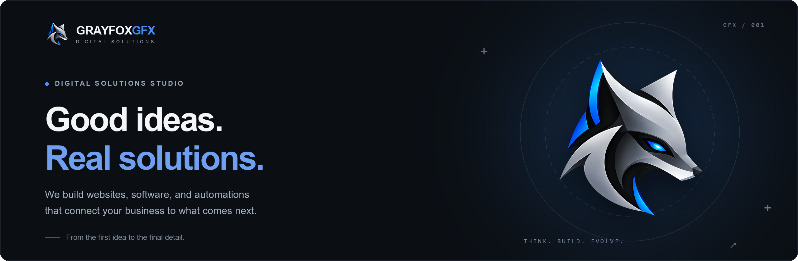

 

**English** · [Español](README.es.md)

 

<b>● &nbsp;WHAT WE DO</b>

## Technology with purpose.

Every business has a different challenge. We build the solution it actually needs.

| | Service | | |
|:--|:--|:--|:--|
| `01` | **Web development** | Make your first impression count. Fast, accessible websites built to connect. | Business websites · E-commerce · Portals |
| `02` | **Custom software** | Tools that adapt to your operation, not the other way around. | Business systems · Dashboards · APIs |
| `03` | **Automation & AI** | Fewer repetitive tasks. More time to move your business forward. | Workflows · Integrations · Artificial intelligence |
| `04` | **Cloud & DevOps** | A solid foundation to launch, operate, and keep growing. | Azure · Docker · CI/CD |
| `05` | **Ongoing support** | Your project keeps evolving. We stay with you beyond launch. | Maintenance · Updates · Monitoring |

 

<b>● &nbsp;FEATURED WORK</b>

## From challenge to solution.

<table>
<tr>
<td width="50%" valign="top">

REAL ESTATE PLATFORM 
**[Marlene Solís Bienes Raíces](https://marlenesolis.com)** 
A real estate platform connecting properties, people, and new opportunities. Property search by transaction type, location, and price, with real estate service information and contact options.

Delivered · Ongoing support

</td>
<td width="50%" valign="top">

WEBSITE 
**[Agente Carranza](https://agentecarranza.mx)** 
Website delivered by GrayFoxGFX, with ongoing work after launch.

Delivered · Ongoing support

</td>
</tr>
</table>

 

<b>● &nbsp;HOW WE WORK</b>

## A clear process. From start to finish.

| `01` Discover | `02` Design | `03` Build | `04` Evolve |
|:--|:--|:--|:--|
| We understand your business, your goals, and the problem to solve. | We shape the experience and define a concrete plan. | We develop, test, and take care of the details. | We launch with you and support your next step. |

<b>TOOLS CHANGE. GOOD JUDGMENT STAYS.</b>

      

 

<b>● &nbsp;WHAT COMES NEXT</b>

## Curiosity is part of the work.

**GrayFox Labs** is our space for exploring ideas, prototypes, and artificial intelligence. New experiments coming soon. `EXPLORING`

 

---

<b>● &nbsp;LET'S BUILD SOMETHING</b>

### Your next chapter starts with an idea.

Tell us what you have in mind. Let's talk about making it happen.

 

Thoughtful technology. Meaningful solutions.

